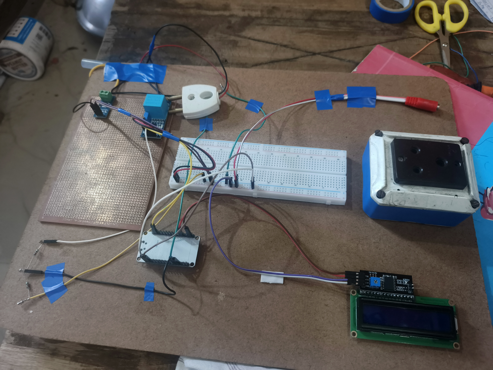
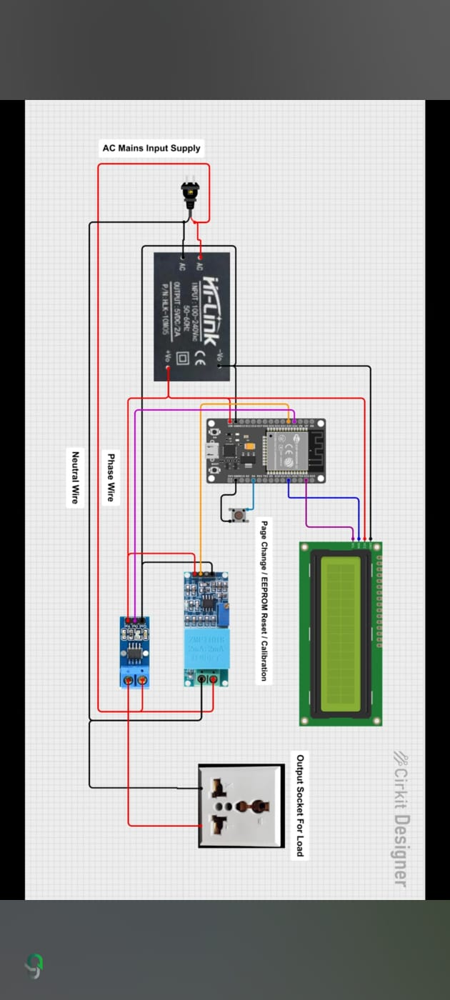

# ⚡ IoT-Based Appliances Power Tracker

A compact IoT device that measures real-time power consumption of household appliances and visualizes usage trends on a live Power BI dashboard.


Live demo: https://iot-based-appliance-power-tracker-d-orpin.vercel.app/

---

## 🔍 What It Does

- 📟 Reads live **voltage, current & power** and displays it on an LCD
- ☁️ Streams readings to the cloud for logging and remote viewing
- 📊 Feeds a **live Power BI dashboard** — daily/weekly trends & cost estimates
- 🔌 Switches the appliance on/off remotely via a relay
- 🔘 One button handles page change, calibration & reset

🔗 **Live Power BI Dashboard:** `[add your published report link]`

---

## 📡 Live Status

<p align="center">
  
  
  
</p>

These badges pull live from a small API that reads the latest document out of MongoDB:

```js
// backend/routes/liveStatus.js
app.get('/api/live-status', async (req, res) => {
  const latest = await db.collection('readings').findOne({}, { sort: { time: -1 } });
  res.json({
    power: latest.power,
    efficiency: latest.efficiency,
    uptime: latest.uptimeDays
  });
});
```

Point the three badge URLs above at your deployed endpoint (Render/Railway/Vercel all work) and GitHub will re-fetch them automatically each time someone views the README — genuinely live, no manual updates.

---

## 🔧 Hardware Build

<p align="center">
  
</p>

| Part | What it does |
|---|---|
| **ESP8266 / NodeMCU** | The brain — reads sensor data, controls the relay, drives the LCD, and sends data over WiFi |
| **HLK-10M05 AC-DC Module** | Converts mains AC to 5V DC to safely power the whole circuit |
| **Current Sensor** | Measures how much current the appliance is drawing |
| **5V Relay Module** | Acts as a switch — lets the ESP turn the appliance on/off |
| **I2C 16x2 LCD** | Shows live readings directly on the device |
| **Push Button** | Cycles LCD pages, and triggers calibration/EEPROM reset |
| **Output Socket** | Where the monitored appliance plugs in |

---

## 🖇️ Circuit Diagram

<p align="center">
  
</p>

**How the signal flows:**
1. Mains AC powers the HLK-10M05, which supplies clean 5V DC to the ESP module
2. The current sensor sits on the live wire and feeds current readings to the ESP
3. The ESP processes readings, shows them on the LCD, and sends them to the cloud
4. The relay — controlled by the ESP — switches the output socket (the load) on or off

---

## 🛠️ Tech Stack

**Firmware:** C++ (Arduino), ESP8266/ESP32 — reads sensors and controls hardware
**Backend:** Python + Node.js + MongoDB — processes and stores incoming data
**Analysis:** TensorFlow Lite — for usage pattern/anomaly detection
**Visualization:** Power BI — turns stored data into live, readable dashboards

---

## 🚀 Quick Start

```bash
git clone https://github.com/Kararsubhojit26/iot-appliances-power-tracker.git
# Flash /firmware via Arduino IDE
cd backend && npm install && npm start
# Connect Power BI to MongoDB/API and publish
```

---

## 👤 Author

**Subhojit Karar** — B.Tech CSE
📧 Kararsubhojit26@gmail.com · [GitHub](https://github.com/Kararsubhojit26) · [LinkedIn](https://linkedin.com/in/subhojit-karar-299033247)

<p align="center">⭐ Star this repo if you found it useful!</p>
